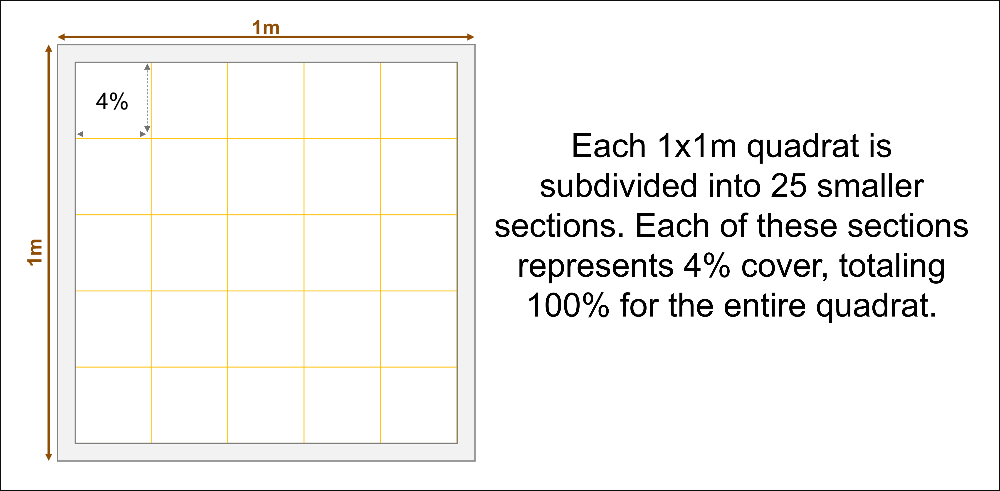

---
output:
  html_document:
    toc: yes
    toc_depth: 5
    toc_float: yes
  pdf_document:
    toc: yes
    toc_depth: '5'
editor_options: 
  markdown: 
    wrap: 72
---

```{r echo=FALSE, warning=FALSE}
library ("leaflet")
```

```{r echo=FALSE}
toolik_locations <- read.csv("../Data/Toolik_LTER_site_location.csv")
```


# Introduction

Plant abundance is measured as relative percent cover every year across
multiple plant community types. We do this to monitor changes in plant
communities over time in response to experimental manipulations like
nutrient addition and animal exclosures.

## LTER Nutrient Addition Sites

```{r echo=FALSE}

awesome <- makeAwesomeIcon(
  icon = "info",
  iconColor = "black",
  markerColor = "blue",
  library = "fa"
)

leaflet(toolik_locations) %>% 
  addTiles() %>%
  addScaleBar() %>%
  addAwesomeMarkers(lng = ~Long,
                    lat = ~Lat,
                    icon = awesome, 
                    popup = ~ Location)
```

For Google Maps compatible (WGS84) coordinates for each site & block:

```{r echo=FALSE}
    xfun::embed_file('../Data/Toolik_LTER_site_location.csv', text = 'CLICK HERE TO DOWNLOAD')
```

For exact locations of all plot corners (UTM, zone 6N - NAD83):

```{r echo=FALSE}
    xfun::embed_file('../Data/LTER_Sites_PlotCorners.csv', text = 'CLICK HERE TO DOWNLOAD')
```

**\*\*** **If this is your first time at Toolik or going to these sites
I highly recommend you look at this online ArcMap of the LTER sites that
Miriam Ritchie made in 2021:** [CLICK
HERE](https://mbl.maps.arcgis.com/apps/mapviewer/index.html?webmap=736146be65fe4dc586d233656286255e)

## List of site in order of priority

*This might change for 2023 and beyond...Check with LTER lead RA*

1.  MAT06 (BLock 1-3)
2.  MAT89
3.  WSG89_inlet
4.  WSG89_outlet
5.  DHT89
6.  SHB89
7.  MNN97
8.  MNT97
9.  MAT81 (*Historic*)

## When do we measure?

-   Plant cover should be estimated around "peak green" (when plants are
    at their greenest)
-   This typically occurs in mid July but can vary year to year
    depending on if it is an early or late spring

## Supplies

-   Two or more **1 m\^2 quadrats** divided into 25 (20x20cm)
    subquadrats: constructed out of PVC and string (*typically located
    under the lab*)



-   **Data sheets**

    ```{r echo=FALSE}
    xfun::embed_file('../Data/LTER_cover_datasheet_template.csv', text = 'Download datasheet here')
    ```

    -   Print on **Rite in the Rain** paper (must use a laser printer
        for this or the ink wont dry)
        -   There is a laser printer in Lab 2 however it tends to be a
            bit finicky.

        -   Easiest way to print is to use the computers in the entry
            way of the dinning hall.

            1.  Either email yourself the file or put it on a flash
                drive
            2.  Bring *Rite in the Rain* paper with you to the dinning
                hall
            3.  Log into dinning hall computers using guest log in, and
                pull up the file you want to print
            4.  Printer is located in the staff office to the left. Go
                into the office (*if there is no meeting going on*) and
                add your *Rite in the Rain* paper to the first tray in
                the printer.
            5.  Go back to computer and print
            6.  Collect your data sheets and any left over *Rite in the
                Rain Paper* from the tray

-   **Clipboard**

-   **Pencils**

-   **Note book**

-   **Camera/Cellphone -** used to take photos of any unknown species
    you encounter so you can look it up later

```{r, echo=FALSE}
xfun::embed_file('../Data/LTER_cover_datasheet_template.csv', text = 'Download DATASHEET TEMPLATE here')
```

# Field procedure

-   There is an 8m long transect in each plot where we measure plant
    cover each year
    -   1 m\^2 quadrats are placed side by side down this transect
        \*Typically we use 2-3 qudrants at a time and work in teams of
        3-4 (2-3 observers and/or 1-2 recorders)
-   To estimate plant cover do your best to get a birds-eye view of the
    quadrant
-   One 20x20cm sub square represents about % 4 of the area of the
    quadrant
-   Using this as a guide you will estimate the area (in percent) of the
    plot a given species makes up. Typically it is easiest to go square
    by square and add up as you go
    -   **TIP** - Sometimes I will intentionally overestimate the cover
        of a species in one square if there are several squares with
        less than \<1%. (Example: I will call a square that has 2% cover
        of *Betula* 3% if the next few squares after it each have a very
        small amount)

**NOTE:** Cover will be relativized so it's okay if the quadrat totals
do not total to 100%


## **CALIBRATION**

An important step before you start recording data is to **"Calibrate"**
with the other observers to make sure you are all getting around the
same numbers (within 5-10%). **Calibration should be done each time you
do cover, any time you begin a different plant community (ex: switching
from MAT to DHT), as well as after breaks (ex: after a lunch break)**

1.  Pick one species that everyone will then practice estimating its
    cover
2.  Once everyone has their estimated value, have each person report the
    number they arrived at.
    -   The first time you do this it is common to arrive a very
        different numbers. Some people may have overestimated while
        others underestimated. It's also common to miss patches of the
        species or confuse it for another.
3.  Discuss how each person arrived at their number (ie. What they saw,
    and how they estimated its cover)
4.  Make a plan for how you will all estimate going forward so that you
    all estimate in similar ways and arrive at the same numbers.
5.  Repeat this process for multiple species until you consistently
    arrive at similar values.
    -   Make sure to practice with at least one of each kind of
        functional group as they have very different structures and thus
        might be estimated differently.
        -   moss/lichen

        -   graminoid

        -   standing dead

        -   litter

        -   forb

        -   deciduous shrub

        -   evergreen shrub

        -   tussock/*Eriophorum*

------------------------------------------------------------------------

# Answers to practice question


------------------------------------------------------------------------
