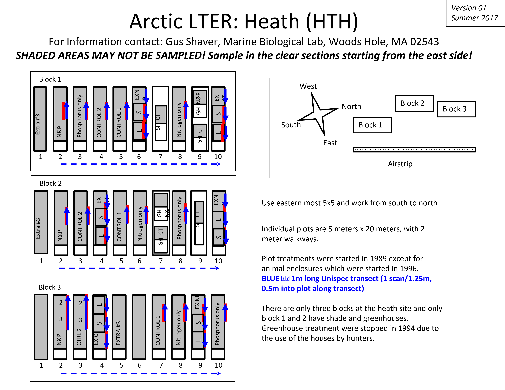
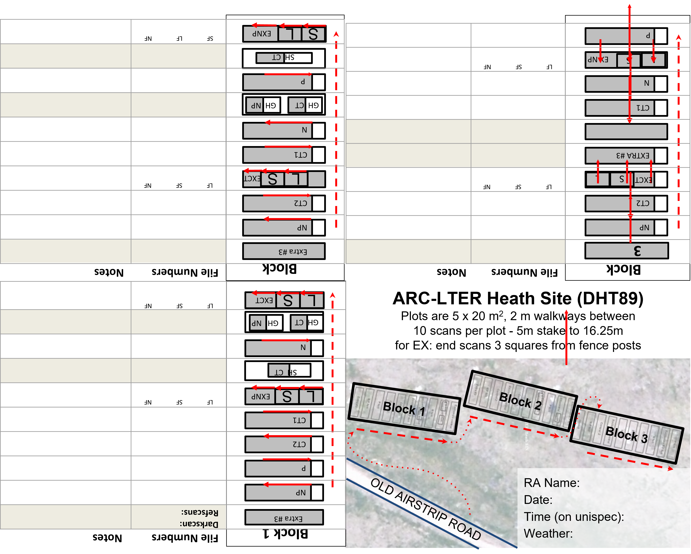
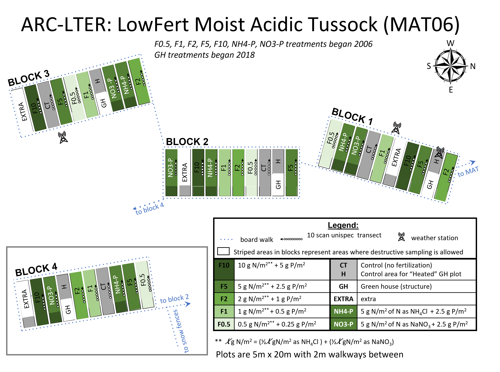
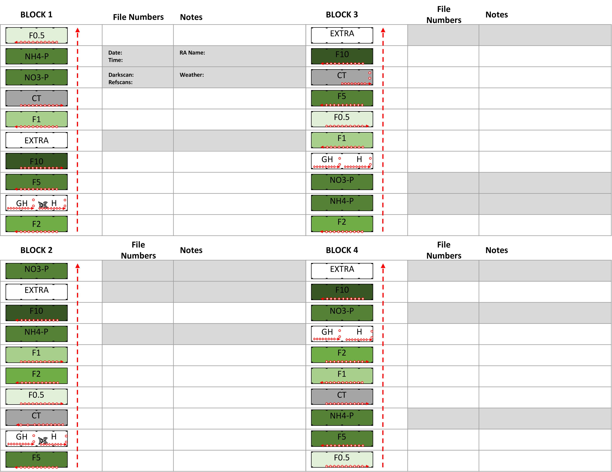
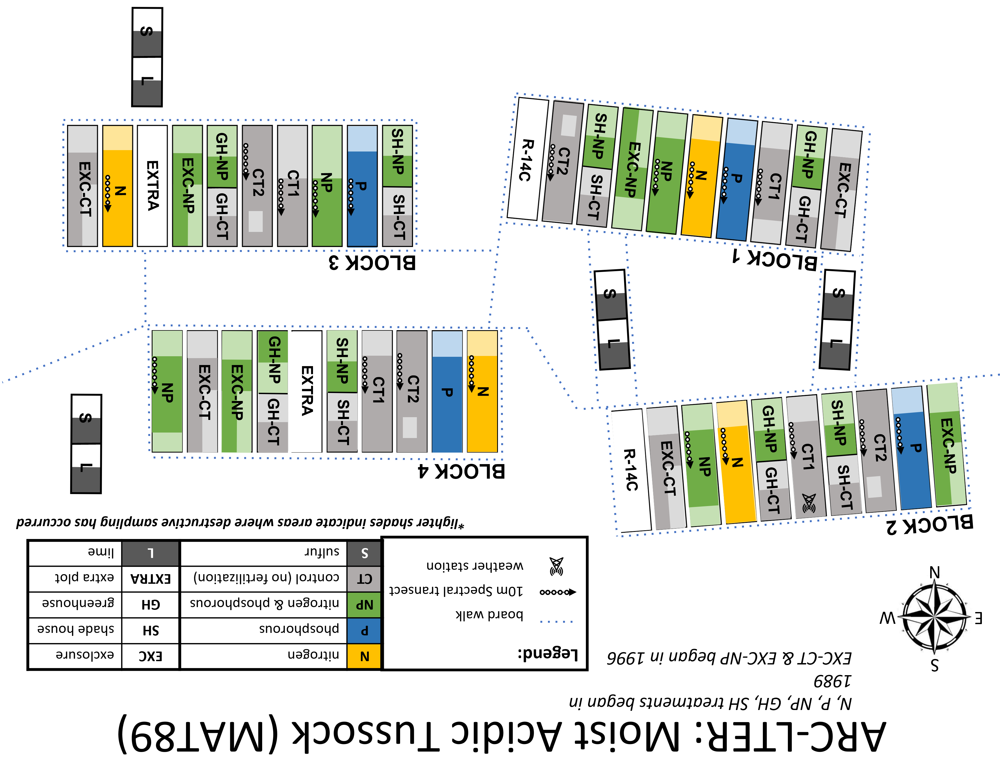
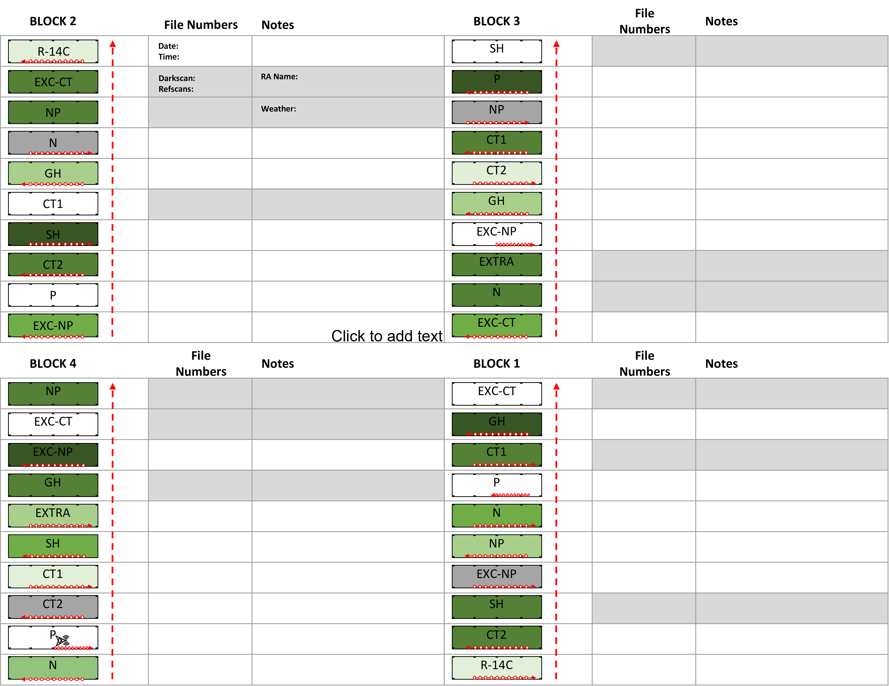

# **LTER plot and unispec maps**
-------------------------------------------------------------------
-------------------------------------------------------------------


```{r, echo=FALSE}
xfun::embed_file('../Images/LTER_heath_map.png', text = 'Click HERE to download image')
```  

-------------------------------------------------------------------
-------------------------------------------------------------------

## **LTER Heath NDVI maps**  
  
```{r, echo=FALSE}
xfun::embed_file('../Images/LTER_heath_NDVI_map.png', text = 'Click HERE to download image')
``` 

-------------------------------------------------------------------
-------------------------------------------------------------------

  
```{r, echo=FALSE}
xfun::embed_file('../Images/LTER_06MAT_map.png', text = 'Click HERE to download image')
``` 

-------------------------------------------------------------------
-------------------------------------------------------------------

## **LTER 06MAT NDVI maps**  
  
```{r, echo=FALSE}
xfun::embed_file('../Images/LTER_06MAT_NDVI_map.png', text = 'Click HERE to download image')
``` 

-------------------------------------------------------------------
-------------------------------------------------------------------

  
```{r, echo=FALSE}
xfun::embed_file('../Images/LTER_89MAT_map.png', text = 'Click HERE to download image')
```

-------------------------------------------------------------------
-------------------------------------------------------------------

## **LTER 89MAT NDVI maps**  
 
```{r, echo=FALSE}
xfun::embed_file('../Images/LTER_89MAT_NDVI_map.png', text = 'Click HERE to download image')
```

