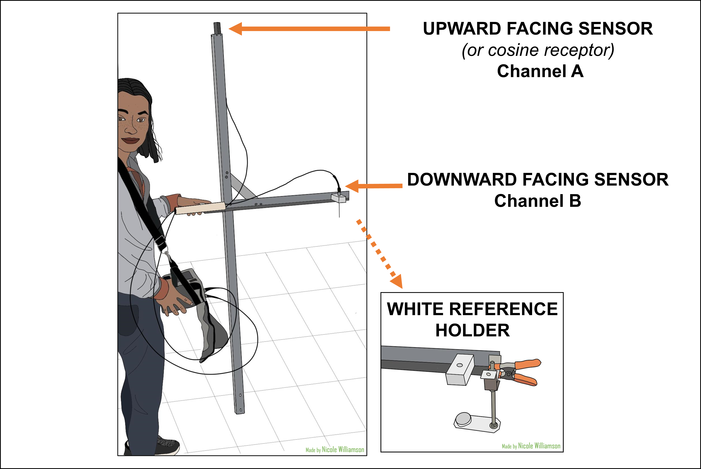
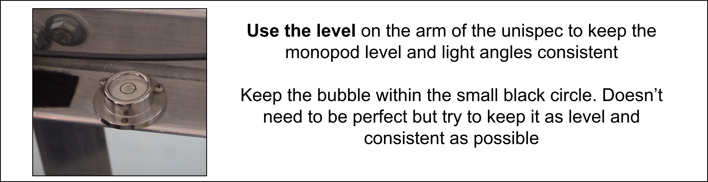

---
output:
  html_document:
    toc: yes
    toc_depth: 5
    toc_float: yes
  pdf_document:
    toc: yes
    toc_depth: '5'
editor_options: 
  markdown: 
    wrap: 72
---

\

# **Introduction**

*Complete these steps at each site and each time you are setting up the
UniSpec DC.* **Before operating read through the handout A People's
Guide to Unispec-DC Measurement and Data Prep by Jeremy K. Caves.**
*Consult the UniSpec-DC manual (in binder) for more information on the
instrument.*

### Why Measure?

Unispec measurements provide a wealth of information on the status of
the vegetation, from phenology to productivity and beyond. The protocol
may take a while to master, but is set-up to optimize efficiency and
before long will become second nature. Keep in mind that you are adding
to over a decade of spectral reflectance data! Enjoy your time out on
the tundra & do your best to make quality measurements.

### Where to Measure?

Use the [LTER plot/NDVI maps](LTER_Unispec_site_map.html) to determine
order and location of measurements. There are 10 sites, 1-4 blocks per
site, many plots for multiple treatments per block. Typically, make 5
measurements per plot along a 5m long Unispec transect as marked on
maps. Scans are made 0.5m into plot (given monopod arm length). This is
the default order in which the "unispec_key.csv" file is organized,
telling you which measurement belongs to which plot.

1.  **Move between plots** at a site following dashed line with arrow in
    LTER Site Maps.
2.  **Make 5 measurements per plot** in direction of solid line with
    arrow marking 5m Unispec transect. Each location is marked with a
    round silver tag on the boardwalk or stake (except DHT, HST, SHB,
    some NANT plots -- do your best to estimate even spacing).
3.  **Place monopod base on edge of plot** so that monopod arm faces
    over plot. Align with stakes marking plot edge, and place in line
    with the silver tag so that the monopod arm is perpendicular to plot
    edge. For some locations, you may need to place monopod base further
    into the plot to avoid measuring flag or puddle (see complete list
    of these locations in [APPENDIX A] below). Monopod arm should still
    be perpendicular to plot edge.

### When to Measure?

1.  **Try to measure each site once a week.** This is often not possible
    given weather conditions. Consult PI on site and timing priorities
    for each summer. Try to capture green-up (early-mid June), peak
    greenness (early-mid July), and senescence (mid-August).

2.  **Minimize shadows by measuring close to Solar Noon (13:00).** Try
    not to start before 10:00 or go past 15:00. If it is slightly
    overcast with more diffuse light, shadows are less of a problem. Try
    to measure sites at similar times of day within throughout the
    summer. Example Unispec schedule typical of 2017-2018 summers when
    good weather:

    a.  Day 1: up the hill to MAT89, MAT06, WSG89-inlet in the morning;
        drive to p-loop WSG89-outlet, DHT89 in the afternoon
    b.  Day 2: boat across the lake to MNN97, MNT97 in the morning;
        drive to SHB89-B1, SHB89-B2, MAT81 in the afternoon

3.  **What is "good enough" weather to spec?** Since we're using the
    Dual Channel Unispec, varying light levels are less important for
    measurements, as each scan takes into account upward and downward
    light. Highly variable cloud cover does makes it difficult as the
    raw spectra will change a lot and can easily max out (above 65,000
    A/D). Be sure there is enough light to make good readings (max of
    CHANNEL A around 50,000 A/D). Balance getting any data with getting
    good data and always make note weather conditions and other factors!

4.  **Avoid taking measurements of wet vegetation.** Water droplets on
    leaves can artificially lower the NDVI. You may need to wait for
    vegetation to dry.

### Equipment List

1.  **Unispec DC with PCMIA card** and adapter inserted.
2.  **2 x foreoptic cables** in protective box. Cable A connecting to
    the **cosine receptor** (small black rectangular prism). Cable B has
    a **long metal tube** to adjust the FOV.
3.  **Monopod** - 2m metal cross.
4.  **White reference** disc in bag with sandpaper.
5.  **Reference disc holder** and **orange clamp.**
6.  **Site maps on clipboard.**
7.  **Notebook & pencil**

------------------------------------------------------------------------

# **Operating the Unispec**

 

**To Charge**

-   Plug cord into back of device

    -   If the light is blinking green, then it needs to charger
    -   If light is solid green, then it is fully charged

**ON/OFF** switch located in the bottom corner on the back of the device

-   Can take a while to turn on, be patient
-   Sometimes you need to turn the brightness up to see the screen
    better

\

Navigate the device using the **track pad/cursor**

-   The cursor disappears when you move it so you need to keep track of
    where ti is/where you left it on the screen
-   **Pro tip!!** If you loose track of where the cursor is click the
    "OK" button, then click "1" again, and the curse will always be
    hovering over the "OK" button on the screen

\

Checking the battery level

-   Click the green battery in the bottom right of the screen next to
    the time to check battery level

-   The read it gives you is not very accurate/reliable but can be used
    as a general gauge of how charged it is

------------------------------------------------------------------------

------------------------------------------------------------------------

# **Field Procedure**

## **Preparing for the field - in lab**

**Charge the Unispec the DAY BEFORE** you intend to head out, and during
lunch if doing more than 3 sites per day.

### Setting up the Instrument

*You can do the following steps in the field. However, it's easier to do
them in the lab before you leave for the field.*

1.  **Turn on device** (*give it about 10 minutes to warm up*)

2.  Access the the **set up menu** by pressing **"1"**

    -   In the ***"File Prefix"*** box, enter the **site name
        abbreviation** (Ex: mat06\_ )
    -   Change ***"Start number"***to **0**
    -   Make sure **"Scan button does one scan"** is selected, but check
        that the **"autointegration time"** is set to **20000sec** (to
        prevent automatic scans)

    

3.  Set the **save folder**

    -   Click the *"Browse"* button next to the *"Default data directory
        and file"* box

    -   Then click *"Storage Card"*

    -   Then create a folder with today's date (YYYY-MM-DD)

        -   Files will then automatically save into this folder with the
            site prefix and then the file file number, counting up (Ex:
            mat06_00001.spu)

    

4.  **Turn off** the device

5.  Pack the unispec in the bottom of a field backpack

    -   You can find backpacks on the rack in the entryway to the lab
        with the drying ovens in Lab 2.
    -   **If you are going across the lake make sure you put the unispec
        and other equipment into a dry bag!**

### What to Bring?

-   **Unispec DC with PCMIA card** and adapter inserted

-   **Monopod** - 2 meter metal cross

-   **Reference disc holder** & orange clamp

-   **White reference** disc in bag with sandpaper

-   **Silver clipboard with;**

    -   **2 x foreoptic cables** in protective box. Cable A connecting
        to the **cosine receptor** (small black rectangular prism).
        Cable B has a **long metal tube** to adjust the FOV.
    -   **Site maps on clipboard**
    -   **Copy of the unispec instructions**
    -   **UNISPEC KEY (to record date, weather, #\'s for dark scan,
        reference scan, file numbers for each treatment)**

-   **Notebook & pencil**

    \

-   Locate the Monopod

    -   typically located by the rack next to the flammable cabinet
    -   make sure the white reference holder/clip is attached to the
        monopod. You can either leave this on while you carry it to the
        the field, or you can take it off and store it in the backpack

-   Don't forget your own supplies!

    -   Bear spray
    -   Water
    -   Sunscreen
    -   Bug spray/bug jacket (**DO NOT USE DEET** near the equipment,
        and be mindful of it being on your hands/what you touch. DEET
        will damage glass and plastic and could ruin the sensors)
    -   Extra layers
    -   Snacks!

------------------------------------------------------------------------

## **In the field**

\

1.  When you arrive at your site, the first thing you should do it
    **take out the Unispec and turn it on.**
2.  Wait **10 min** for machine to warm up. **While waiting:**
    a.  **Attach the upward and downward facing foreoptics** **to the
        monopod** (DO NOT ATTACH TO UNISPEC YET)

        **TIP:** Hold both cables in one hand while supporting the
        monopod in its upright position. Carefully attach upward facing
        sensor first by sliding the wire into the slot on the tip of the
        monopod so that the rectangular sensor sits on top. Then attach
        the downward facing sensor to the arm of the monopod by sliding
        the needle-like end into the hole in the plastic white rectangle
        so that that the needle-like end is facing down towards the
        ground. Finally, while being careful not to twist or bend the
        cables, or let the ends touch the ground, feed the ends of both
        cables through the PVC tube and attach.

    b.  **Clip white reference holder** onto monopod

    c.  **Weather / Conditions**-- write in notebook. Clouds, haziness,
        sun angle, moisture on leaves all affect scans.

\

2.  Dawn the unispec by putting the strap over your head and around your
    neck. Adjust straps so that the device rests in a comfortable
    position**. If you didn't set scan preferences before heading into
    the field, do so now per the instructions in the previous section.**

    a.  Press "1"

    b.  Change **"Scans to Average"** to **10**

    c.  **Set integration time** according to weather:

        -   40-50 ms -- sunny

        -   70-100 ms -- mildly cloudy

        -   160-200 ms -- thick clouds

            *When set, click "OK" then it will say "rebooting detector
            channels" Once that message is gone, you should be ready to
            take a scan*

    **Click
    [HERE](https://drive.google.com/uc?export=download&id=10nLcimt4lkBuAqe5e404z_V3cYgiPFEo)
    for a video further explaining integration time.**

3.  **Perform throwaway scan:** Initializes channels after the
    instrument has been turned off. **Press "2" when ready to take the
    scan.**

    a.  **RECORD THROWAWAY SCAN FILE NUMBER**

4.  **Perform a dark scan:** Fold the cover of the case over and press
    it into the ports for the two cables on the back of the device so
    that no light can get in. **Press "3" when ready to take scan.**

5.  **Check the dark scan readings:**

    a.  Values btw 100-300 A/D are optimal. Relatively uniform noise
        across all wavelengths. 
    b.  Dark scan measures instrument noise. Important to redo if you
        change integration time by **more than 40ms** or temperature
        changes.
    c.  **RECORD DARK SCAN NUMBER.** You can see the scan number
        displayed along the bottom of the screen

\

6.  **Attach foreoptics cables to UniSpec.** Cables and ports are color
    coordinated

    a.  **orange** = Channel A/upward facing sensor
    b.  **green** = Channel B/downward facing sensor

7.  **Perform the WHITE reference scan**

    a.  White reference disc should theoretically reflect 100% of the
        light coming in. This only happens if its clean, and free from
        scratches. **DO NOT touch the surface of the disc**, only touch
        the sides. Oil from your hands can distort light refection.
        **Examine disc before use** to make sure it is clean, sandpaper
        surface if necessary.

    b.  **Place the disk in the white reference holder** (attach if need
        be) **beneath the downward facing sensor**-- make sure it is
        close but no shadow on disc and it is at the same angle to sun
        as the upward facing sensor. To check if disk is under the
        sensor by removing the sensor from its holder and looking down
        through the hole to make sure you see the white disk.

    c.  Go to the plot you are going to take measurements in and line
        the unispec up in the same location and direction as you will be
        taking your real measurements. Do your best to also make sure
        the monopod is level (use the level on the arm of the monopod).
        **Take a measurement by pressing "2"**

        i.  **CHECK THE REFLECTANCE VALUES -** for the white reference
            you want channel A and B to look similar and have similar
            magnitudes
        ii. Channel A max should be around 50,000 A/D. Channel B should
            be similar but tends to be a bit lower

    d.  **Take 4 more scans in the same spot** (total of 5) to account
        for small changes in light and cloud cover.

    e.  **RECORD WHITE REFERENCE FILE NUMBERS**

    f.  Remove the white reference disk and holder and store in backpack

\

8.  **Prep for real measurements:** 

    a.  Press "1"
    b.  Change **"Scans to Average"** to **1**

9.  **Make real measurements**

    a.  Align the monopod on the edge of the plot. Level with the
        bubble. **Press 2.**

    b.  Check to make sure CHANNEL A and CHANNEL B **do not max out at
        65000 A/D.** If so, redo measurements with a shorter integration
        time.  

    c.  Check that upward facing CHANNEL A has higher raw signal values
        than downward facing CHANNEL B (the only exception is the REF
        scan). Ideally, the raw signal spectra should peak at **around
        50,000 A/D** for CHANNEL A.

    d.  Take 5 measurements along 5m transects as marked on plot maps
        and with silver tags on boardwalk. 

    e.  RECORD WHICH BLOCK AND PLOT CORRESPONDS TO EACH SET OF 5 FILES
        **before** moving onto the next treatment

        **NOTE:** *If cloud/lighting conditions change a lot while you
        are taking measurements, take another set of white reference
        scans at the end*

10. When you are done, turn the device off. Disconnect the cables, and
    repack everything for transport

11. **Transfer data files and update key THE SAME DAY YOU TAKE
    MEASUREMENTS.** See [data procedure](unispec_data_protocol.html)

------------------------------------------------------------------------

------------------------------------------------------------------------

### **TIPS/Troubleshooting:**

-   **Made a mistake?** If you would like to redo some of your scans,
    you can press 1, and then set the "Start at number" back to whatever
    number you want to restart at. **THIS WILL ERASE all measurements
    you took after that scan number** so make sure you really want to do
    that
-   **Difficulty finding cursor -** Adjust brightness up and down (arrow
    buttons to the middle-right of display) so that white shows up
    better. When you press 1 for "Scan Preferences", the cursor always
    appears over the "OK" button.
-   **Bad Spectra -** If anything looks weird, go back and consult A
    People's Guide to Unispec-DC Measurement and Data Prep for examples
    of spectra and other common problems.
-   **Hazards!** When at shrub sites or near greenhouses or other
    structures, be mindful of where the wires are so they don't get
    snagged on anything
-   **Music/podcasts** - using the unispec can get monotonous, feel free
    to bring music or podcasts to listen to

------------------------------------------------------------------------

------------------------------------------------------------------------
