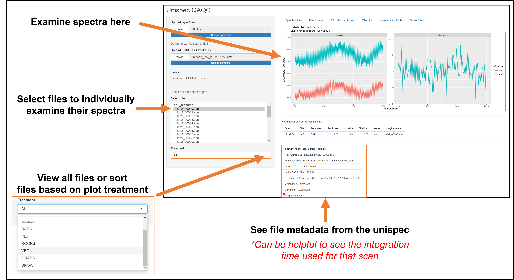

*Transfer files from the PCIMA card to the Dropbox folder on the
computer and run the RScript to quality check **THE SAME DAY** you take
measurements. You may think you have perfect memory now, but you will
forget! Record electronically which file numbers belong to which plots,
reference, or dark scans in the File Key and delete any unnecessary
files.*

## EXPORT THE DATA 

*Transfer the data from the memoroy card in the unispec device to the LTER RA computer/onedrive.*

\

1.  **Remove PCIMA card from Unispec DC**

    -   Eject the card by pressing the small black button next to the
        memory card on the back of the device.

    -   The memory card is contained within an adapter, carefully pull
        the card out of the adapter

2.  **Insert card into reader** with USB connection to computer

    -   **Be careful to align the PCIMA card properly to avoid bending
        any of the metal prongs on the connector!!**
    -   If this occurs, you can straighten with pliers & reinsert card
        to realign. 

3.  **Transfer data folders to computer.** Move folders named with
    (YYYY-MM-DD) containing SITE_XXXXX.spu files to appropriate location
    in OneDrive/Dropbox.

4.  **Fill out Unispec Key,** add notes & file numbers to
    **[YEAR_unispec_key.csv]** excel sheet.
    

## QUALITY CHECK  

*Use the RShiny app created by Jim Laundre to check the quality of the data.*

1. Open the [Unispec Shiny App](https://arc-lter.shinyapps.io/UnispecShiny/)

2. Click “Browse” under “Upload .spu files” and select all the .spu files within today’s date folder

3. CLick “Browse” under “Upload Field Key Excel files” and select the field key you created for today  

\

### **TIPS/Troubleshooting:**

1.  **Missing/mislabeled files.** Human error is real. You hopefully
    kept track of file number / plot correspondence in the field;
    however, if you get back to lab and something doesn't line up, there
    are several tricks you can use.

    a.  **Look at measurement times.** Using the
        "unispec_quality_check.R" file, look at the times you took each
        measurement. One line of code will give you a dataframe with the
        difference in time between each measurement. Usually, you can
        tell which 5 measurement you took at a single plot (small
        difference in times) and when you moved between plots (longer
        times) or blocks (even longer) depending on how far you have to
        walk.  
    b.  **Check spectra**. You may have simply be off by one due to
        mislabeled reference or dark scans. Check the spectra of any
        subset of file numbers to make sure

# **APPENDIX A. Unispec Location Anomalies**

List of irregular unispec locations:

1.  WSG-outlet locations are along the entire side of the plot not
    confined to 5m, to avoid water.
2.  COMPILE DESCRIPTIVE LIST HERE. BE SPECIFIC.

------------------------------------------------------------------------

------------------------------------------------------------------------

### OLD PROTOCOL:
1.  **Open ["process_unispec_files.Rmd"] R Markdown notebook in
    RStudio.** Work through the document to:

    a.  **Quality Check data by:**

        i.  **Choose white references** and update **unispec Key
            [YEAR_unispec_key.csv]** (File Numbers for rows where
            Treatment = REF) 
        ii. **Exclude bad data** with maxed out spectra or other issues.

    b.  **Calculate vegetation indices ["process_unispec_files.Rmd"]**
        markdown notebook.

2.  **Save data** to **[CONSULT JIM/LAURA ON FILEFORMAT / LOCATION]**

3.  **Add data to Shiny App** to compare with other years by moving
    updated dataframe into ["shiny_unispec"] directory housing web
    application. Publish application to the web using RStudio, access
    at: [<https://rubytessa.shinyapps.io/shiny_unispec/>]

